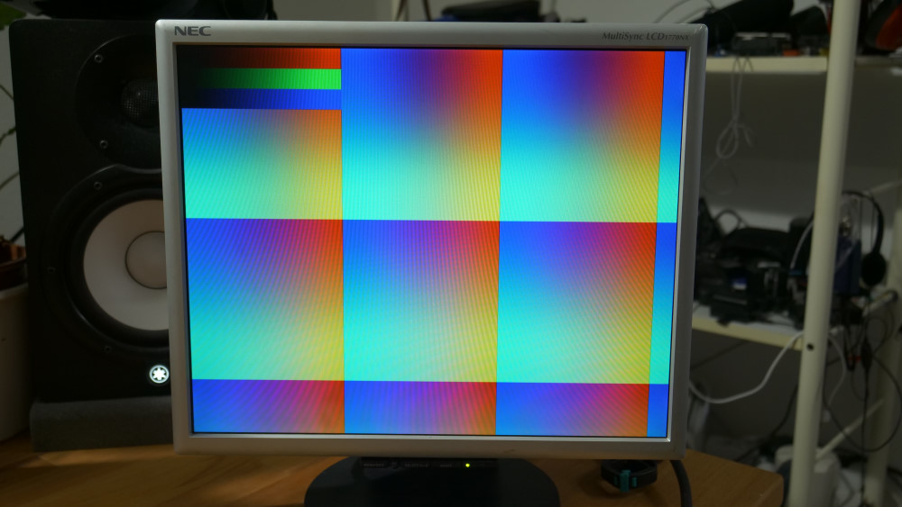

# ESP32 S3 VGA

Basic example is in luniVGA. 
The whole repo is also a library for Arduino. An Adafruit GFX library wrapper is in examples GfxWrapper. More follows. Higher resolution lose sync on PSRAM.

Check out the video for this project https://youtu.be/muuhgrige5Q

Only compatible with 8MB psram version ESP32 S3 for high resolutions. 

test image:

# Support

Please support the development:

Paypal: https://paypal.me/bitluni

Github Sponsors: https://github.com/sponsors/bitluni

Patreon: https://www.patreon.com/bitluni

...or by sharing and attributing :-*
